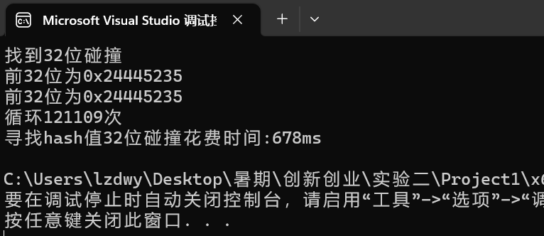

# implement the Rho method of reduced SM3

## ρ攻击原理

ρ 攻击利用了 SM3 压缩函数中的非线性变换部分，通过构造一组具有特殊结构的输入，使得压缩函数在处理这些输入时，会产生一些特殊的状态。在这些特殊的状态下，压缩函数的输出值会重复出现，从而导致不同的输入最终产生相同的哈希值。

## 实现过程

我们寻找hash函数值的32位的碰撞。

首先，对unsigned int 类型的变量i进行hash的实现方式如下：

```c++
std::string str = std::to_string(x);//转化为字符串
//unsigned int message_len = strlen(str.c_str());

unsigned char hash[EVP_MAX_MD_SIZE];
unsigned int hash_len;

EVP_Digest(str.c_str(), 256, hash, &hash_len, EVP_sm3(), NULL);
```

为得到32位碰撞，我们取四个unsigned char 类型的hash[i]，并将其拼接为一个unsigned int 类型的变量：

```c++
unsigned int join4(unsigned int a, unsigned int b, unsigned int c, unsigned int d)
{
	return ((a << 24) | (b << 16) | (c << 8) | d);
}
```

为接住函数返回的四个hash[i]，我们创建结构体four，并将hash过程写为一个函数，返回一个four类型的结构体：

```c++
struct four {
	unsigned int a;
	unsigned int b;
	unsigned int c;
	unsigned int d;
};


four hash_4(unsigned int x)
{
	four tem;
	std::string str = std::to_string(x);//转化为字符串
	unsigned int message_len = strlen(str.c_str());

	unsigned char hash[EVP_MAX_MD_SIZE];
	unsigned int hash_len;

	EVP_Digest(str.c_str(), 256, hash, &hash_len, EVP_sm3(), NULL);
	tem.a = (unsigned int)hash[0];
	tem.b = (unsigned int)hash[1];
	tem.c = (unsigned int)hash[2];
	tem.d = (unsigned int)hash[3];
	return tem;
}

```

循环主体如下：

```c++
for (int i = 0; i < ; i++)
	{

		if (tem1.a == tem2.a && tem1.b == tem2.b && tem1.c == tem2.c&&tem1.d==tem2.d)
		{
			cout << "找到32位碰撞" << endl;
			cout << "前32位为0x" << hex << tem1.a << hex << tem1.b << hex << tem1.c << hex << tem1.d << endl;
			cout << "前32位为0x" << hex << tem2.a << hex << tem2.b << hex << tem2.c << hex << tem2.d << endl;
			cout << "循环" << dec << i << "次" << endl;
			clock_t end = clock();
			double endtime = (double)(end - start) / CLOCKS_PER_SEC;
			cout << "寻找hash值32位碰撞花费时间:" << endtime * 1000 << "ms" << endl;    //ms为单位
			//system("pause");
			return 0;
		}
		else
		{
			tem1 = hash_4(result1);
			result1 = join4(tem1.a, tem1.b, tem1.c,tem1.d);


			tem2 = hash_4(result2);
			result2 = join4(tem2.a, tem2.b, tem2.c,tem2.d);
			tem2 = hash_4(result2);
			result2 = join4(tem2.a, tem2.b, tem2.c,tem2.d);

			/*if (i % 100 == 0)
			{
				cout << result1 << endl << result2 << endl;
			}*/
		}

	}
```

## 实现结果



| 位数         | 32bits       |
| ------------ | ------------ |
| **循环次数** | **121109次** |
| **时间**     | **678ms**    |

